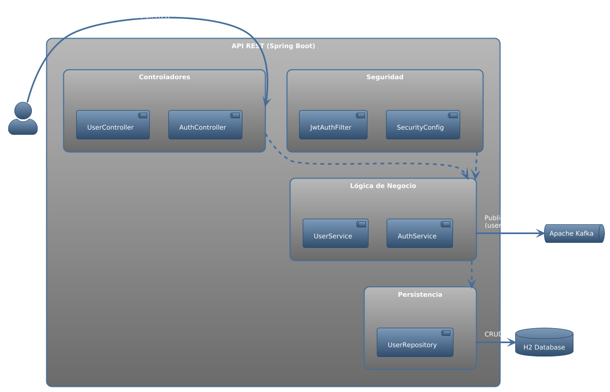

# 🚀 User API — Spring Boot (Ejercicio BCI)

API RESTful de **creación de usuarios** que cumple el enunciado del ejercicio “Java Especialista Integración”. El servicio acepta y retorna **solo JSON** 🧾, valida correo y contraseña por **expresiones regulares configurables** 🔐, y persiste un **token** (JWT) junto con el usuario. Incluye documentación **Swagger** 📖, colección **Postman** 🧪, y orquestación opcional con **Docker Compose** 🐳 (BD y Kafka).

> **Stack:** ☕ Java 17 · ⚡ Spring Boot 3 · 🛠️ Maven · 🗃️ JPA/Hibernate · 🧩 H2 (default) / PostgreSQL · 🔑 JWT · 📑 Swagger/OpenAPI · 🧪 Testcontainers · 🐳 Docker Compose · 📡 Kafka (opcional)

---

## 📋 Tabla de contenido

- [🗂️ Arquitectura](#arquitectura)
- [⚙️ Requisitos previos](#requisitos-previos)
- [🛠️ Configuración](#configuración)
- [▶️ Ejecutar la app](#ejecutar-la-app)
    - [💻 Opción A: Local (H2, sin Docker)](#opción-a-local-h2-sin-docker)
    - [🐳 Opción B: Local + Docker (PostgreSQL y Kafka)](#opción-b-local--docker-postgresql-y-kafka)
    - [📦 Opción C: Todo en Docker](#opción-c-todo-en-docker)
- [🔗 Endpoints](#endpoints)
    - [📝 Registro de usuario](#registro-de-usuario)
    - [🔐 Login de usuario](#login-de-usuario)
    - [🔒 Endpoint protegido de ejemplo](#endpoint-protegido-de-ejemplo)
    - [⚠️ Formato de errores](#formato-de-errores)
- [🔑 Autenticación](#autenticación)
- [📖 Documentación Swagger](#documentación-swagger)
- [🧪 Colección Postman](#colección-postman)
- [📡 Eventos Kafka (opcional)](#eventos-kafka-opcional)
- [✅ Pruebas](#pruebas)
- [📂 Estructura del proyecto](#estructura-del-proyecto)
- [📝 Decisiones y notas](#decisiones-y-notas)

---

## 🗂️ Arquitectura

Servicio monolítico Spring Boot con capas **controller → service → repository**, persistencia JPA y seguridad JWT. Opcionalmente emite un **evento de dominio** al registrar un usuario (Kafka).



---

## ⚙️ Requisitos previos

- ☕ **Java 17** y **Maven 3.9+**
- 🐳 **Docker** y **Docker Compose** (si se usa la Opción B/C)
- 🧪 (Opcional) **Postman** para importar la colección de ejemplos

---

## 🛠️ Configuración

Crea un archivo `.env` (para Docker) o usa variables de entorno/sistema al ejecutar localmente.

```properties
# Perfil de Spring
SPRING_PROFILES_ACTIVE=h2          # valores: h2 (default) | postgres
SERVER_PORT=8080

# JWT
JWT_SECRET=change-me-super-secret
JWT_TTL_MINUTES=120

# BD H2 (perfil h2)
# Sin variables adicionales; datos en memoria

# BD PostgreSQL (perfil postgres)
DB_HOST=localhost
DB_PORT=5432
DB_NAME=userdb
DB_USERNAME=user
DB_PASSWORD=pass

# Kafka (opcional)
KAFKA_BOOTSTRAP_SERVERS=localhost:9092
USER_EVENTS_TOPIC=users.registration
```

> 💡 Si usas perfiles de Spring, también puedes pasarlos con `-Dspring-boot.run.profiles=h2|postgres` o `-Dspring.profiles.active=...`.

---

## ▶️ Ejecutar la app

### 💻 Opción A: Local (H2, sin Docker)

```bash
mvn clean spring-boot:run -Dspring-boot.run.profiles=h2
```

La app queda en `http://localhost:8080` con BD en memoria.

### 🐳 Opción B: Local + Docker (PostgreSQL y Kafka)

1. Levanta infraestructura:
   ```bash
   docker compose up -d
   ```
2. Arranca la app apuntando a PostgreSQL (y Kafka si lo usas):
   ```bash
   mvn clean spring-boot:run -Dspring-boot.run.profiles=postgres
   ```

### 📦 Opción C: Todo en Docker

```bash
# Construir imagen
mvn -DskipTests clean package
docker build -t userapi:latest .

# Ejecutar (variables de entorno según .env)
docker run --env-file .env -p 8080:8080 userapi:latest
```

---

## 🔗 Endpoints

Base URL por defecto: `http://localhost:8080`

### 📝 Registro de usuario

**POST** `/api/users/register`

#### Request (JSON)

```json
{
  "name": "Juan Rodriguez",
  "email": "juan@rodriguez.org",
  "password": "Hunter2!",
  "phones": [
    {
      "number": "1234567",
      "citycode": "1",
      "countrycode": "57"
    }
  ]
}
```

> ✅ Las validaciones de **email** y **password** se realizan por **expresiones regulares configurables**.

#### Response — 201 Created

```json
{
  "id": "7b1a6f0e-1f0a-4a1e-9c5f-0d8f8f1a2b3c",
  "created": "2025-08-15T12:34:56Z",
  "modified": "2025-08-15T12:34:56Z",
  "last_login": "2025-08-15T12:34:56Z",
  "token": "<JWT>",
  "isactive": true,
  "name": "Juan Rodriguez",
  "email": "juan@rodriguez.org",
  "phones": [
    { "number": "1234567", "citycode": "1", "countrycode": "57" }
  ]
}
```

#### ⚠️ Errores frecuentes

- **409 Conflict** – `{"mensaje": "El correo ya registrado"}`
- **400 Bad Request** – `{"mensaje": "Email inválido"}` / `{"mensaje": "Password inválido"}` / `{"mensaje": "Payload inválido"}`
- **415 Unsupported Media Type** – si no envías `Content-Type: application/json`
- **406 Not Acceptable** – si no solicitas `Accept: application/json`

### 🔐 Login de usuario

**POST** `/api/auth/login`

#### Request (JSON)

```json
{
  "email": "juan@rodriguez.org",
  "password": "Hunter2!"
}
```

#### Response — 200 OK

```json
{
  "token": "<JWT>",
  "last_login": "2025-08-15T12:34:56Z"
}
```

### 🔒 Endpoint protegido de ejemplo

**GET** `/api/users/secure/test`

Requiere header `Authorization: Bearer <token>` usando el **token** retornado al registrarte o loguearte.

#### Response — 200 OK

```json
{ "status": "ok" }
```

### ⚠️ Formato de errores

Todos los **errores** retornan **solo JSON** con el siguiente esquema:

```json
{ "mensaje": "descripcion del error" }
```

---

## 🔑 Autenticación

El servicio usa **JWT Bearer**. El **token** se **genera y persiste** junto con el usuario en el registro o login, y puede reutilizarse para invocar endpoints protegidos. Envía:

```
Authorization: Bearer <token>
```

---

## 📖 Documentación Swagger

- UI: `http://localhost:8080/swagger-ui/index.html`
- OpenAPI JSON: `http://localhost:8080/v3/api-docs`

---

## 🧪 Colección Postman

En el repositorio se incluye `HTTP Collection - Postman.json` dentro de `/docs/` para probar los endpoints. En Postman: **Import → File → Seleccionar archivo** y carga el JSON.

---

## 📡 Eventos Kafka (opcional)

Al registrar un usuario se publica un evento en **Kafka** (si está habilitado). Configura el tópico con `USER_EVENTS_TOPIC` (default: `users.registration`). Ejemplo de evento:

```json
{
  "type": "USER_REGISTERED",
  "userId": "7b1a6f0e-1f0a-4a1e-9c5f-0d8f8f1a2b3c",
  "email": "juan@rodriguez.org",
  "createdAt": "2025-08-15T12:34:56Z"
}
```

---

## ✅ Pruebas

- **Unitarias/integración:**
  ```bash
  mvn -DskipTests=false test
  ```
- (Opcional) **Allure**:
  ```bash
  # requiere CLI de Allure instalada
  allure serve target/allure-results
  ```

---

## 📂 Estructura del proyecto

```text
userapi/
├─ docs/                     # diagramas y documentación
├─ src/
│  ├─ main/
│  │  ├─ java/
│  │  │  └─ .../controller   # REST controllers
│  │  │           /service   # lógica de negocio
│  │  │           /repository# repositorios JPA
│  │  │           /model     # entidades y DTOs
│  │  │           /security  # JWT, filtros
│  │  └─ resources/
│  │      ├─ application.properties
│  │      └─ db/**           # scripts si aplica
│  └─ test/
│     └─ java/               # tests (JUnit/Testcontainers)
├─ Dockerfile
├─ docker-compose.yml
├─ pom.xml
└─ README.md
```

---

## 📝 Decisiones y notas

- **Tokens y fechas:** `last_login` se actualiza tanto en el registro como en el login. `modified` coincide con `created` hasta futuras actualizaciones.
- **Validaciones:** Las regex de **email** y **password** son **configurables** vía propiedades de la app.
- **Id de usuario:** Se usa **UUID**.
- **Perfiles:** `h2` para desarrollo rápido; `postgres` para entornos con Docker Compose.
- **Compatibilidad de payload:** si ya tienes clientes previos, verifica el *case* de las propiedades dentro de `phones` y ajusta la colección Postman si fuera necesario.

---

### 🛠️ Snippets útiles

**cURL – Registro**

```bash
curl -i -X POST http://localhost:8080/api/users/register \
  -H "Content-Type: application/json" -H "Accept: application/json" \
  -d '{
    "name": "Juan Rodriguez",
    "email": "juan@rodriguez.org",
    "password": "Hunter2!",
    "phones": [{"number": "1234567", "citycode": "1", "countrycode": "57"}]
  }'
```

**cURL – Login**

```bash
curl -i -X POST http://localhost:8080/api/auth/login \
  -H "Content-Type: application/json" -H "Accept: application/json" \
  -d '{
    "email": "juan@rodriguez.org",
    "password": "Hunter2!"
  }'
```

**cURL – Endpoint protegido**

```bash
curl -i http://localhost:8080/api/users/secure/test \
  -H "Authorization: Bearer <TOKEN>" -H "Accept: application/json"
```

